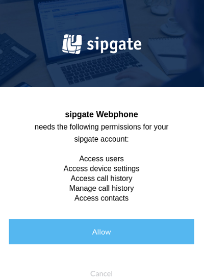

# REST API

## Authentication

### Simple authentication for scripts using Basic Auth

If you simply want to access your own data through the API you do not have to use oAuth authorization delegation. Simply use [Basic Auth](https://tools.ietf.org/html/rfc2617#section-2) to access our API.

**Attention:** Never use Basic Auth, if you want to access the data of someone else in your app.

To get basic information about your account you can query the [/account](ref:getaccount-1) route:

```bash
curl \
--request GET \
--header "Accept: application/json" \
--user <your_sipgate_username>:<your_sipgate_password> \
https://api.sipgate.com/v2/account
```

Or you could send an SMS:
```bash
curl \
--request POST \
--header "Content-Type: application/json" \
--header "Accept: application/json" \
--user <your_sipgate_username>:<your_sipgate_password> \
--data '{"smsId": "<your_sms_id>", "recipient": "<phone_number>", "message": "I :love: sipgate!"}' \
https://api.sipgate.com/v2/sessions/sms
```


### Authenticating users in third party applications 

When building a third-party application users will have to authorize via the OAuth authorization code flow. 
Refer to our guide about [managing third-party clients](doc:managing-third-party-clients-using-the-command-line) to learn how to obtain a `clientId` and `clientSecret`. After that your application will be able to query the sipgate REST API.  

During the authorization process the user will be asked to grant permission to your client to access the REST API. The user will have the option to allow the access or cancel the authorization process.



You can find an example of how to implement this authorization flow in our [rest api example](/v2.0/docs/building-a-third-party-application-using-oauth-clients).


## API Reference

You can find our API Reference here:

[https://api.sipgate.com/v2/doc](https://api.sipgate.com/v2/doc)

You can find examples here:

[https://github.com/sipgate/rest-api-examples](https://github.com/sipgate/rest-api-examples)

## OAuth2 scopes

Scopes are used to grant an application different levels of access to data on behalf of the end user. As an example, the scope for sending SMS (`/sessions/sms`) is `sessions:sms:write`.

!!! info "A word about security"
    It is generally a good idea to only use a minimal set of scopes to maximize security.

| Scope name | Description |
|----------- |-------------|
| `all` | Full access |
| `contacts:read` | Read contact information |
| `devices:localprefix:read` | Read your device settings for localprefix |
| `devices:sim:read` | Read your sim device settings |
| `devices:tariffannouncement:write` | Modify your device settings for tariff announcement |
| `phonelines:blockanonymous:read` | Read your block anonymous settings |
| `phonelines:blockanonymous:write` | Change your block anonymous settings |
| `phonelines:devices:write` | Modify your phone line devices |
| `phonelines:forwardings:read` | Read your phone line forwardings |
| `phonelines:read` | Read your phone line settings |
| `phonelines:sipgateio:read` | Read your phone line sipgate.io settings |
| `phonelines:sipgateio:write` | Modify your phone line sipgate.io settings |
| `phonelines:voicemails:greetings:write` | Modify your phone line voicemail greetings |
| `phonelines:voicemails:read` | Read your phone line voicemails |
| `phonelines:write` | Modify our phone line settings |
| `portings:read` | Read your portings |
| `push_device:register` | Register device for push notifications |
| `sessions:sms:write` | Send SMS |
| `settings:sipgateio:write` | Modify your sipgate.io settings |
| `sms:callerid:write` | Modify your short message services |
| `sms:write` | Modify your short message services |
| `users:read` | Read user information |
| `account:read` | Read account information |
| `account:write` | Modify your account |
| `addresses:read` | Read address information |
| `addresses:write` | Modify your addresses |
| `authorization:oauth:clients:read` | Read your oauth clients |
| `authorization:oauth:clients:write` | Modify your oauth clients |                                                                                                                                                                                                            
| `balance:read` | Read balance information |                                                                                                                                                                                                                                  
| `contacts:write` | Write contact information |                                                                                                                                                                                                                               
| `devices:callerid:read` | Read your device settings for callerId |                                                                                                                                                                                                           
| `devices:callerid:write` | Modify your device settings for callerId |                                                                                                                                                                                                        
| `devices:localprefix:write` | Modify your device settings for localprefix |                                                                                                                                                                                                  
| `devices:read` | Read your devices |                                                                                                                                                                                                                                         
| `devices:sim:write` | Modify your sim device settings |                                                                                                                                                                                                                      
| `devices:sims:orders:write` | Order new SIM cards |                                                                                                                                                                                                                          
| `devices:singlerowdisplay:read` | Read your device settings for single row display |                                                                                                                                                                                         
| `devices:singlerowdisplay:write` | Modify your device settings for single row display |                                                                                                                                                                                      
| `devices:tariffannouncement:read` | Read your device settings for tariff announcement |                                                                                                                                                                                      
| `devices:write` | Modify your devices |                                                                                                                                                                                                                                      
| `faxlines:numbers:read` | Read your fax line numbers |                                                                                                                                                                                                                       
| `faxlines:read` | Read your fax line settings |                                                                                                                                                                                                                              
| `faxlines:write` | Modify your fax line settings |                                                                                                                                                                                                                           
| `groups:devices:write` | Modify your group devices |                                                                                                                                                                                                                         
| `groups:faxlines:read` | Read your group faxlines |                                                                                                                                                                                                                          
| `groups:numbers:read` | Read numbers routed to your groups |                                                                                                                                                                                                                 
| `groups:read` | Read your groups |                                                                                                                                                                                                                                           
| `groups:users:read` | Read your group members |                                                                                                                                                                                                                              
| `groups:voicemails:read` | Read your group voicemails |                                                                                                                                                                                                                      
| `history:read` | Read your history |                                                                                                                                                                                                                                         
| `history:write` | Modify your history |                                                                                                                                                                                                                                      
| `notifications:read` | Read notifications |                                                                                                                                                                                                                                  
| `notifications:write` | Modify notifications |                                                                                                                                                                                                                               
| `numbers:read` | Read your numbers |                                                                                                                                                                                                                                         
| `numbers:write` | Route numbers to phone lines |                                                                                                                                                                                                                             
| `openid` | Identify you uniquely through your sipgate login |                                                                                                                                                                                                                
| `phonelines:busyonbusy:read` | Read your busy on busy settings |                                                                                                                                                                                                             
| `phonelines:busyonbusy:write` | Change your busy on busy settings |                                                                                                                                                                                                          
| `phonelines:devices:read` | Read your phone line devices |                                                                                                                                                                                                                   
| `phonelines:forwardings:write` | Modify your phone line forwardings |                                                                                                                                                                                                        
| `phonelines:numbers:read` | Read your phone line numbers |
| `phonelines:parallelforwardings:read` | Read your parallel forwardings |
| `phonelines:parallelforwardings:write` | Modify your parallel forwardings |
| `phonelines:sipgateio:log:read` | Read your phone line sipgate.io log |
| `phonelines:voicemails:greetings:read` | Read your phone line voicemail greetings |
| `phonelines:voicemails:write` | Modify your phone line voicemails |
| `portings:write` | Modify your portings |
| `sessions:calls:write` | Initiate phone calls |
| `sessions:fax:write` |Send Fax |
| `sessions:write` | Initiate sessions |
| `settings:read` | Read your settings |
| `settings:sipgateio:read` | Read your sipgate.io settings |
| `settings:write` | Modify your settings |
| `sms:callerid:read` | Read your short message services |
| `sms:read` | Read your short message services |
| `users:defaultdevice:write` | Modify your default device settings |

## Real Time Call Manipulation

### What is Real Time Call Manipulation?

The Real Time Call Manipulation API enables you to modify currently running calls. Every call has a `callId` and you can use this ID to modify the state of that call.

### What is the callId?

The `callId` will either be pushed to you by using a [Webhook](/v2.0/reference#the-post-request)  (see `callId`) or you can obtain it by initiating a call using the [/sessions/calls](/v2.0/reference#newcall) endpoint (see `sessionId`).

### Authentication

You only have to add the `Authorization: Bearer <access_token>` header to your requests.
There are currently two ways to obtain an `access_token`:

#### Using sipgate authentication
 
You can obtain an `access_token` by using curl:

```shell
 curl \
--request POST \
--header 'Content-Type: application/x-www-form-urlencoded' \
--header 'Accept: application/json' \
--data-urlencode "client_id=sipgate-app-web" \
--data-urlencode "grant_type=password" \
--data-urlencode "username=<your_sipgate_email>" \
--data-urlencode "password=<your_sipgate_username>" \
https://api.sipgate.com/login/sipgate-apps/protocol/openid-connect/token
```

The response will contain a `token` which can be used as `access_token`:
```
{"token":"eyJ0eXAiOiJKV1...."}
```

### Using OAuth 2.0 authentication

Read the chapter on [OAuth 2.0 Authentication](doc:authentication) to obtain an `access_token`.


#### How to get all running calls

You only need your `access_token` to call the [/calls](/v2.0/reference#getcalls) endpoint.

```bash
curl \
--verbose \
--request GET \
--header "Authorization: Bearer <access_token>" \
--header "Content-Type: application/json" \
--url https://api.sipgate.com/v2/calls
```


#### How to put a call on hold

You can put all call participants on hold or retrieve them by using the [/calls/{callId}/hold](/v1.0/reference#setcallhold) endpoint. All you need is the `callId` and your `access_token`:

```bash
# Hold                                           
curl \
--verbose \                                   
--request PUT \ 
--header "Authorization: Bearer <access_token>" \       
--header "Content-Type: application/json" \
--url https://api.sipgate.com/v2/calls/<callId>/hold \
--data '{ "value": true }'                                                                                                                                                                                                                                   
# Retrieve
curl \                                              
--verbose \
--request PUT \
--header "Authorization: Bearer <access_token>" \
--header "Content-Type: application/json" \
--url https://api.sipgate.com/v2/calls/<callId>/hold \
--data '{ "value": false }'
```

#### How to mute/unmute a call

You can use the [/calls/{callId}/muted](/v2.0/reference#setcallmuted) endpoint to mute or unmute your microphone. All you need is the `callId` and your `access_token`:

```bash
# Mute
curl \
--verbose \
--request PUT \
--header "Authorization: Bearer <access_token>" \
--header "Content-Type: application/json" \
--url https://api.sipgate.com/v2/calls/<callId>/muted \
--data '{ "value": true }'

# Unmute
curl \
--verbose \
--request PUT \
--header "Authorization: Bearer <access_token>" \
--header "Content-Type: application/json" \
--url https://api.sipgate.com/v2/calls/<callId>/muted \
--data '{ "value": false }'
```

#### How to transfer a call

You can use the [/calls/{callId}/transfer](/v2.0/reference#transfercall) endpoint to transfer your call to another party. You can choose between attended transfer and blind transfer. All you need is the `callId` and your `access_token`:

```bash
# Attended transfer
curl \
--verbose \
--request POST \
--header "Authorization: Bearer <access_token>" \
--header "Content-Type: application/json" \
--url https://api.sipgate.com/v2/calls/<callId>/transfer \
--data '{ "attended": true, "phoneNumber": "+4915799912345" }'

# Blind transfer
curl \
--verbose \
--request POST \
--header "Authorization: Bearer <access_token>" \
--header "Content-Type: application/json" \
--url https://api.sipgate.com/v2/calls/<callId>/transfer \
--data '{ "attended": false, "phoneNumber": "+4915799912345" }'
```

#### How to record a call

Use the [/calls/{callId}/recording](/v2.0/reference#setcallrecording) endpoint to record a running call. 
Pass `"value": true` to start the recording and `"value": false` to stop it.
You can enable/disable the recording announcement by passing the `announcement` flag.

```bash
# Start recording with announcement
curl \
--verbose \
--request PUT \
--header 'Authorization: Bearer <access_token>' \
--header 'Content-Type: application/json' \
--url https://api.sipgate.com/v2/calls/<callId>/recording \
--data '{ "value": true, "announcement": true }'

# Stop recording without announcement
curl \
--verbose \
--request PUT \
--header 'Authorization: Bearer <access_token>' \
--header 'Content-Type: application/json' \
--url https://api.sipgate.com/v2/calls/<callId>/recording \
--data '{ "value": false, "announcement": false }'
```

To retrieve the recorded file you can use the [/v2/{userId}/history](https://developer.sipgate.io/v2.0/reference#history) endpoint (see `recordingUrl`). 

```bash
curl \
--verbose \
--header "Authorization: Bearer <access_token>" \
--header "Content-Type: application/json" \
--url https://api.sipgate.com/v2/<userId>/history?types=CALL
```

#### How to send DTMF (Dual-tone multi-frequency) sequences

Use the [/calls/{callId}/dtmf](/v2.0/reference#sendcalldtmf) endpoint to send a DTMF sequence to a running call:

```bash
curl \
--verbose \
--request POST \
--header "Authorization: Bearer <access_token>" \
--header "Content-Type: application/json" \
--url https://api.sipgate.com/v2/calls/<callId>/dtmf \
--data '{ "sequence": "*12345#" }'
```

#### How to play an audio file

You can inject any WAV file into a running call by using the [/calls/{callId}/announcements](/v2.0/reference#startcallannouncement) endpoint. All you need is the `callId`, a WAV file and your `access_token`:

```bash
curl \
--verbose \
--request POST \
--header "Authorization: Bearer <access_token>" \
--header "Content-Type: application/json" \
--url https://api.sipgate.com/v2/calls/<callId>/announcements \
--data '{ "url": "https://static.sipgate.com/examples/wav/example.wav" }'
```

**Please note:** Currently the sound file needs to be a mono 16bit PCM WAV file with a sampling rate of 8kHz. You can use conversion tools like the open source audio editor [Audacity](http://www.audacityteam.org/) to convert any sound file to the correct format.

Alternatively you could convert the file using `mpg123` on the command line:

```bash
mpg123 --rate 8000 --mono -w output.wav input.mp3
```

#### How to hang up a call

Use the [DELETE /calls/{callId}](/v2.0/reference#hangupcall) endpoint to terminate a running call. All you need is the `callId` and your `access_token`:

```bash
curl \
--verbose \
--request DELETE \
--header "Authorization: Bearer <access_token>" \
--header "Content-Type: application/json" \
--url https://api.sipgate.com/v2/calls/<callId>
```

