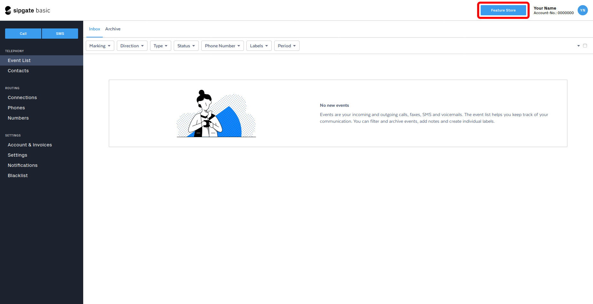

# Set up webhooks in your sipgate account

## Create a sipgate account

To begin developing applications using webhooks you first need to create a sigpgate account. There are different types of accounts: basic, simquadrat and team. All are slightly different but offer webhooks functionality. For the following examples we choose [sipgate basic](https://www.sipgatebasic.co.uk) because it's free (as in beer).

## Book sipgate.io

We will now show you how to book sipgate.io using the Feature Store.

1. Log into your shiny, new sipgate account and go to the Feature Store. You can find a link in the navigation.
   

2. Within the Feature Store click on the sipgate.io feature. It should look like this.
   

3. Click on the orange button to book the free feature and follow the confirmation process.
   

## Enable webhooks

We will now show you how to configure your URLs.

1. Navigate to the sipgate.io category and click on "Incoming calls" or "Outgoing calls"
   

2. Enter your URL and hit "Save".

   
